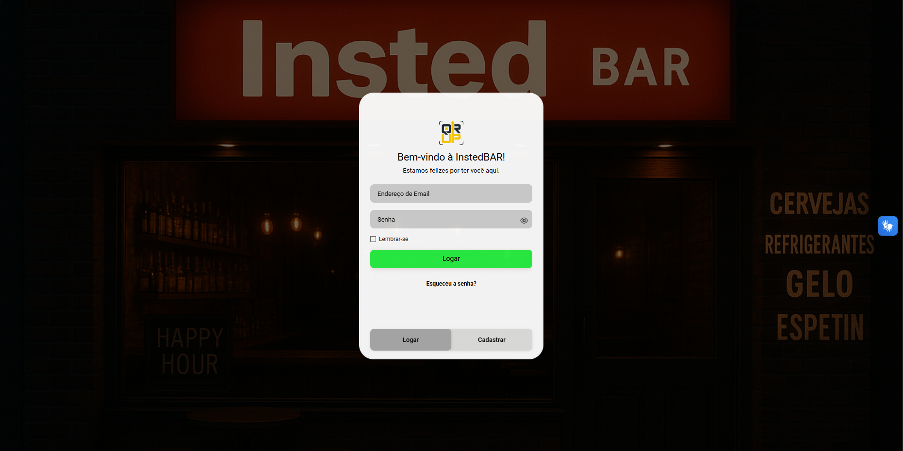
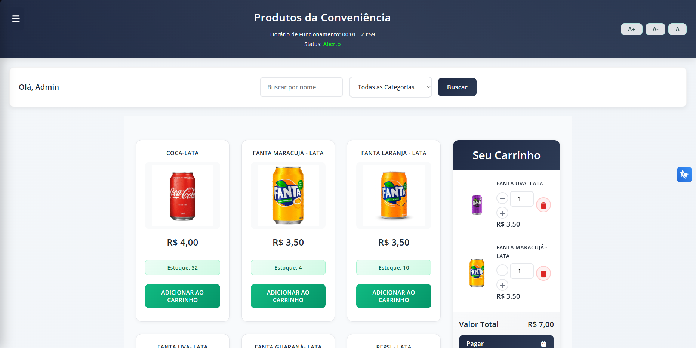
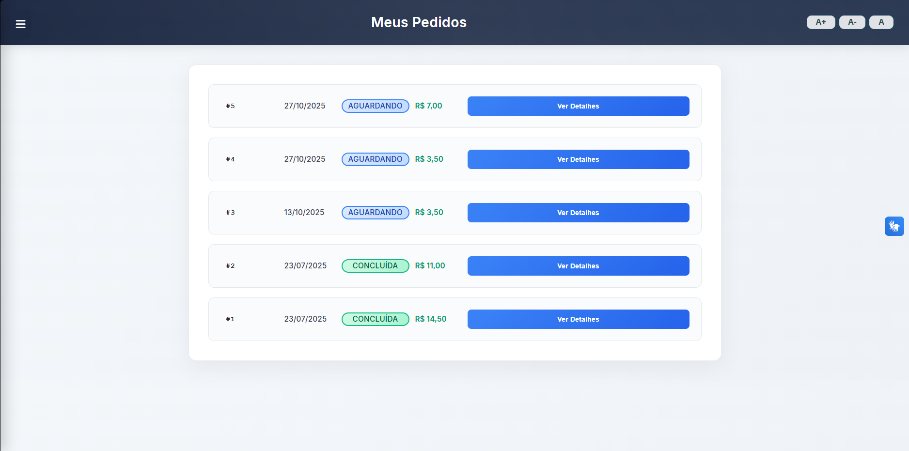
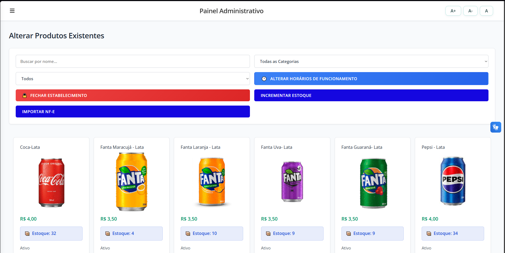
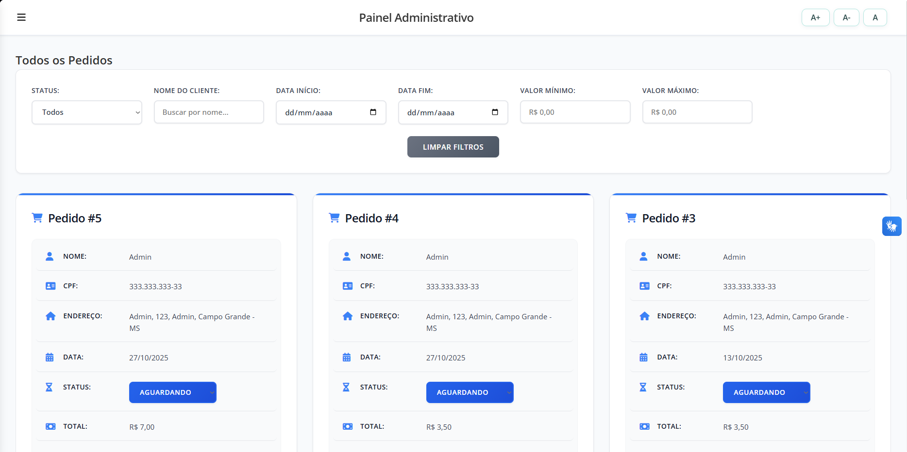
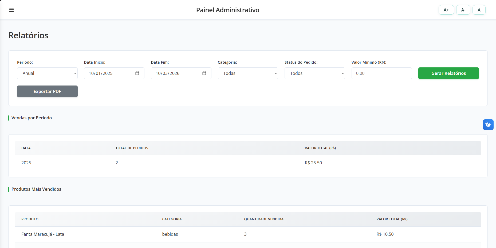

# 🛒 QRUP — Sistema de Catálogo e E-commerce

Sistema web fullstack para gerenciamento de produtos, pedidos e clientes, com painel administrativo completo e autenticação segura.

---

## 📋 Sobre o Projeto

O QRUP é uma aplicação de catálogo e e-commerce desenvolvida com Node.js no backend e HTML/CSS/JavaScript puro no frontend. O sistema possui dois níveis de acesso — **cliente** e **administrador** — com funcionalidades como carrinho de compras, importação de Nota Fiscal Eletrônica, geração de relatórios e controle de estoque.

---

## 📸 Telas do Sistema

### Login


### Catálogo de Produtos com Carrinho


### Meus Pedidos (Cliente)


### Painel Admin — Gerenciamento de Produtos


### Painel Admin — Gerenciamento de Pedidos


### Painel Admin — Relatórios


---

## ✨ Funcionalidades

### 👤 Área do Cliente
- Cadastro e login com reCAPTCHA e validação de força de senha
- Recuperação de senha via código enviado por e-mail
- Catálogo de produtos com filtro por categoria e paginação
- Carrinho de compras e realização de pedidos
- Acompanhamento do histórico de pedidos
- Edição de perfil pessoal

### 🔧 Painel Administrativo
- Gestão completa de produtos (cadastro, edição, controle de estoque)
- Importação de produtos via XML de Nota Fiscal Eletrônica (NF-e)
- Geração e validação de código de barras EAN-13
- Gerenciamento de pedidos com atualização de status
- Controle de horários e status de funcionamento da loja
- Relatórios gerenciais com exportação em PDF:
  - Vendas por período (diário, mensal, anual)
  - Produtos mais vendidos (Top 10)
  - Clientes que mais compraram (Top 10)
  - Desempenho por categoria
  - Taxa de cancelamento

---

## 🛠️ Tecnologias

| Camada | Tecnologias |
|--------|------------|
| **Backend** | Node.js, Express |
| **Banco de Dados** | MySQL, mysql2 |
| **Autenticação** | JWT, bcryptjs |
| **Frontend** | HTML5, CSS3, JavaScript puro |
| **Upload de arquivos** | Multer |
| **E-mail** | Nodemailer + Gmail |
| **PDF** | jsPDF + jsPDF-AutoTable |
| **Segurança** | reCAPTCHA, rate limiting, sanitização de inputs |

---

## 📁 Estrutura do Projeto

```
QRUP/
├── backend/
│   ├── controllers/     # Lógica de negócio
│   ├── models/          # Consultas ao banco de dados
│   ├── routes/          # Definição das rotas da API
│   ├── middlewares/     # Autenticação JWT e validações
│   └── utils/           # E-mail, upload, helpers
├── frontend/
│   ├── pages/           # Páginas HTML
│   ├── css/             # Estilos por página + global
│   └── js/              # Lógica do frontend
└── uploads/             # Imagens dos produtos
```

---

## 🚀 Como Rodar Localmente

### Pré-requisitos
- [Node.js](https://nodejs.org/) v18+
- [MySQL](https://www.mysql.com/) v8+

### Passo a passo

**1. Clone o repositório**
```bash
git clone https://github.com/LuizVfer/QRUP.git
cd QRUP
```

**2. Instale as dependências do backend**
```bash
cd backend
npm install
```

**3. Configure o banco de dados**

Importe o arquivo `qrup.sql` no seu MySQL:
```bash
mysql -u root -p < qrup.sql
```

**4. Configure as variáveis de ambiente**

Crie um arquivo `.env` dentro da pasta `backend/`:
```env
DB_HOST=localhost
DB_USER=root
DB_PASSWORD=sua_senha
DB_NAME=qrup
JWT_SECRET=seu_segredo_jwt
EMAIL_USER=seu_email@gmail.com
EMAIL_PASS=sua_senha_app_gmail
```

**5. Inicie o servidor**
```bash
npm start
```

**6. Acesse no navegador**

Abra o arquivo `frontend/pages/login.html` no seu navegador ou sirva a pasta frontend com um servidor local.

---

## 🔐 Segurança Implementada

- Autenticação via JWT com expiração de 24h
- Senhas criptografadas com bcryptjs
- Rate limiting global (100 req/15min) e por rota
- Proteção contra XSS com sanitização de inputs
- Headers de segurança (X-Frame-Options, CSP)
- Validação de Content-Type e limite de tamanho do body
- reCAPTCHA no login para prevenção de bots

---

