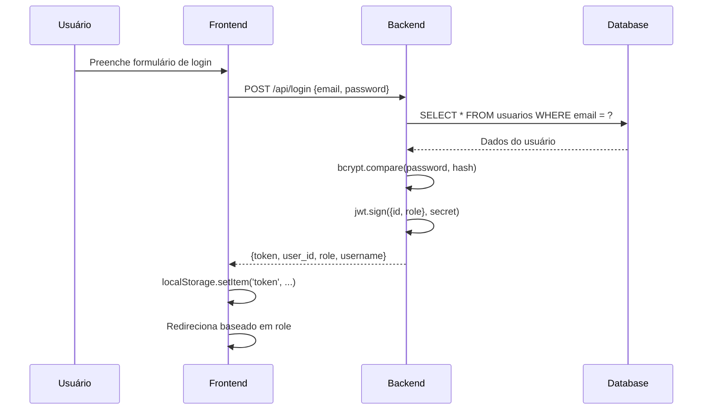
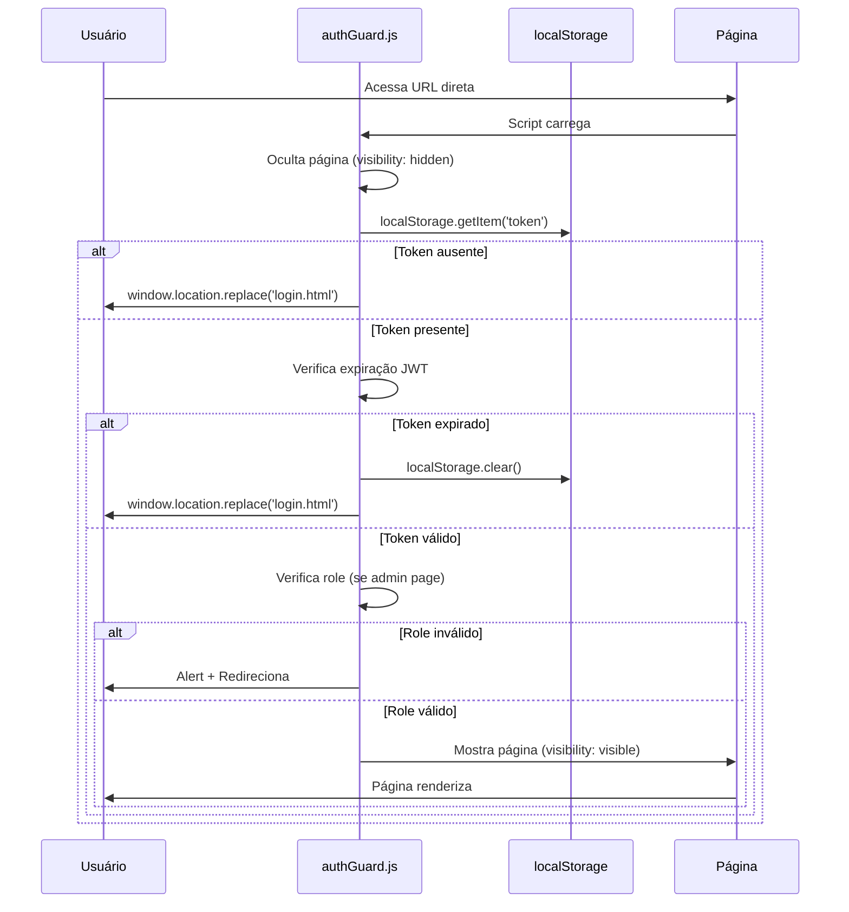
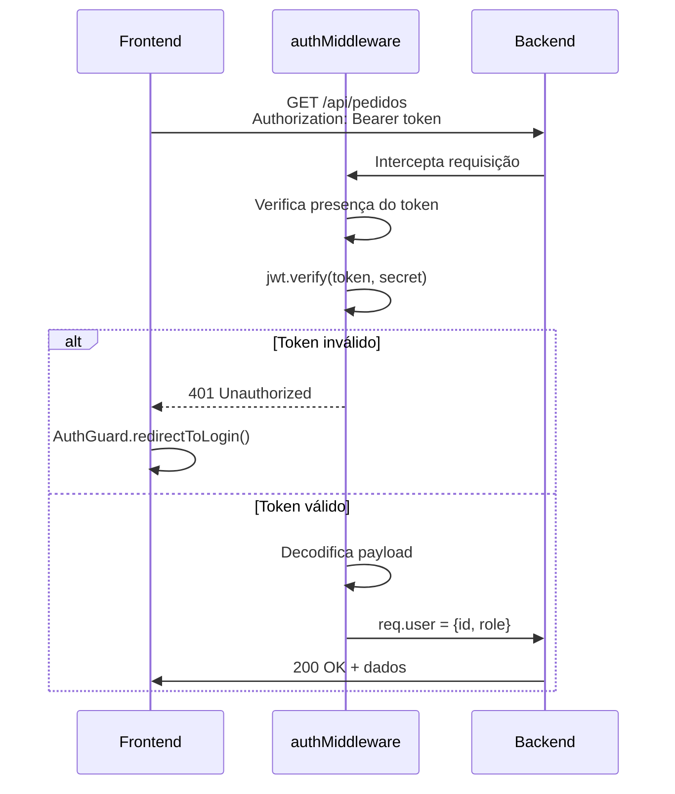

# 🔐 Sistema de Autenticação e Proteção de Rotas - QRUP

> Sistema robusto de autenticação com proteção de rotas no frontend, validação JWT e controle de permissões por role (usuário/admin).

[]()
[]()
[]()

---

## 📋 Índice

- [Sobre](#-sobre)
- [Funcionalidades](#-funcionalidades)
- [Arquitetura](#-arquitetura)
- [Instalação](#-instalação)
- [Configuração](#-configuração)
- [Uso](#-uso)
- [Rotas Protegidas](#-rotas-protegidas)
- [Fluxo de Autenticação](#-fluxo-de-autenticação)
- [Segurança](#-segurança)
- [Troubleshooting](#-troubleshooting)
- [API Reference](#-api-reference)

---

## 🎯 Sobre

Sistema de autenticação completo para aplicação web com controle de acesso baseado em **roles** (funções), proteção de rotas no frontend e backend, e validação em múltiplas camadas.

### Características Principais

- ⚡ **Validação Instantânea**: Redirecionamento em < 50ms sem flash de conteúdo
- 🔒 **Proteção Multicamadas**: Validação cliente + servidor
- 👥 **Sistema de Roles**: Controle granular de permissões (user/admin)
- 🛡️ **JWT Seguro**: Tokens com expiração e validação de assinatura
- 🔄 **Sincronização Cross-Tab**: Logout detectado em todas as abas
- 🚫 **Zero Flash**: Conteúdo protegido nunca é exibido para usuários não autorizados

---

## ✨ Funcionalidades

### Frontend (authGuard.js)

- ✅ Validação síncrona imediata (antes do DOM carregar)
- ✅ Verificação de expiração de token JWT
- ✅ Controle de acesso por role (user/admin)
- ✅ Redirecionamento automático inteligente
- ✅ Monitoramento de logout em múltiplas abas
- ✅ Interceptação de navegação por links
- ✅ Validação adicional com servidor em background

### Backend

- ✅ Autenticação com bcrypt (hash de senhas)
- ✅ JWT com expiração configurável (24h)
- ✅ Middleware de autenticação (authMiddleware)
- ✅ Middleware de verificação de admin (isAdmin)
- ✅ Rate limiting por rota
- ✅ Proteção contra CSRF, XSS, Path Traversal
- ✅ Recuperação de senha com código de verificação

---

## 🏗️ Arquitetura

```
┌─────────────────────────────────────────────────────────┐
│                    FRONTEND                             │
├─────────────────────────────────────────────────────────┤
│                                                         │
│  ┌──────────────────────────────────────────────┐     │
│  │  authGuard.js (Validação Síncrona)           │     │
│  │  • Executa antes do DOM carregar             │     │
│  │  • Valida token no localStorage               │     │
│  │  • Verifica expiração JWT                     │     │
│  │  • Controla acesso por role                   │     │
│  │  • Redireciona instantaneamente               │     │
│  └──────────────────┬───────────────────────────┘     │
│                     │                                   │
│                     ▼                                   │
│  ┌──────────────────────────────────────────────┐     │
│  │  Páginas Protegidas                          │     │
│  │  • catalogo.html (user/admin)                │     │
│  │  • perfil.html (user/admin)                  │     │
│  │  • pedidos.html (user/admin)                 │     │
│  │  • adminPerfil.html (admin only)             │     │
│  │  • adminPedidos.html (admin only)            │     │
│  └──────────────────────────────────────────────┘     │
│                                                         │
└────────────────────┬────────────────────────────────────┘
                     │
                     │ HTTP Requests (Bearer Token)
                     │
┌────────────────────▼────────────────────────────────────┐
│                    BACKEND                              │
├─────────────────────────────────────────────────────────┤
│                                                         │
│  ┌──────────────────────────────────────────────┐     │
│  │  authMiddleware (JWT Validation)             │     │
│  │  • Verifica presença do token                │     │
│  │  • Valida assinatura JWT                     │     │
│  │  • Verifica expiração                        │     │
│  │  • Decodifica payload (user_id, role)        │     │
│  └──────────────────┬───────────────────────────┘     │
│                     │                                   │
│                     ▼                                   │
│  ┌──────────────────────────────────────────────┐     │
│  │  isAdmin Middleware                          │     │
│  │  • Verifica se role === 'admin'              │     │
│  │  • Bloqueia acesso se não for admin          │     │
│  └──────────────────┬───────────────────────────┘     │
│                     │                                   │
│                     ▼                                   │
│  ┌──────────────────────────────────────────────┐     │
│  │  Rotas Protegidas                            │     │
│  │  • /api/verificar-admin (GET)                │     │
│  │  • /api/pedidos (POST, GET)                  │     │
│  │  • /produtos (POST, PUT, DELETE)             │     │
│  │  • /relatorios/* (GET)                       │     │
│  └──────────────────────────────────────────────┘     │
│                                                         │
└─────────────────────────────────────────────────────────┘
```

---

## 🚀 Instalação

### Pré-requisitos

- Node.js >= 14.0.0
- MySQL >= 5.7
- npm ou yarn

### Backend

```bash
cd backend
npm install

# Dependências principais
npm install express
npm install bcryptjs
npm install jsonwebtoken
npm install mysql2
npm install dotenv
npm install cors
npm install express-rate-limit
npm install node-fetch
```

### Frontend

```bash
cd frontend
# Apenas adicionar o arquivo authGuard.js na pasta js/
```

---

## ⚙️ Configuração

### 1. Variáveis de Ambiente (.env)

Crie um arquivo `.env` na raiz do backend:

```env
# Servidor
PORT=3000
NODE_ENV=development

# Banco de Dados
DB_HOST=localhost
DB_USER=root
DB_PASSWORD=sua_senha
DB_NAME=qrup_db

# JWT
JWT_SECRET=sua_chave_secreta_super_segura_aqui_min_32_chars

# CORS
CORS_ORIGINS=http://localhost:5500,http://127.0.0.1:5500

# Rate Limiting
RATE_LIMIT_WINDOW_MS=900000
RATE_LIMIT_MAX_REQUESTS=100

# reCAPTCHA (opcional)
RECAPTCHA_SECRET_KEY=sua_chave_recaptcha
```

### 2. Banco de Dados

Execute o script SQL para criar as tabelas:

```sql
CREATE TABLE usuarios (
  user_id INT PRIMARY KEY AUTO_INCREMENT,
  username VARCHAR(100) NOT NULL,
  email VARCHAR(100) UNIQUE NOT NULL,
  password VARCHAR(255) NOT NULL,
  role ENUM('user', 'admin') DEFAULT 'user',
  created_at TIMESTAMP DEFAULT CURRENT_TIMESTAMP
);

-- Criar usuário admin padrão (senha: admin123)
INSERT INTO usuarios (username, email, password, role) 
VALUES ('Admin', 'admin@qrup.com', '$2a$10$exemplo_hash_bcrypt', 'admin');
```

### 3. Estrutura de Arquivos

```
projeto/
├── backend/
│   ├── config/
│   │   └── db.js
│   ├── controllers/
│   │   ├── authController.js
│   │   ├── produtoController.js
│   │   └── pedidoController.js
│   ├── middlewares/
│   │   ├── authMiddleware.js
│   │   └── routeSecurity.js
│   ├── routes/
│   │   ├── authRoutes.js
│   │   ├── produtosRoutes.js
│   │   ├── pedidoRoutes.js
│   │   └── perfilRoutes.js
│   ├── .env
│   ├── server.js
│   └── package.json
│
└── frontend/
    ├── html/
    │   ├── login.html
    │   ├── registro.html
    │   ├── catalogo.html
    │   ├── perfil.html
    │   ├── pedidos.html
    │   ├── adminPerfil.html
    │   ├── adminPedidos.html
    │   └── adminCadastrarProdutos.html
    ├── js/
    │   ├── authGuard.js          ⭐ NOVO
    │   ├── catalogo.js
    │   ├── adminProducts.js
    │   └── login.js
    └── css/
        └── ...
```

---

## 💻 Uso

### 1. Adicionar authGuard.js em TODAS as páginas HTML

**⚠️ IMPORTANTE**: O script DEVE ser o PRIMEIRO antes de qualquer outro JavaScript.

#### Páginas Públicas (login, registro):

```html
<!DOCTYPE html>
<html lang="pt-br">
<head>
    <meta charset="UTF-8">
    <title>Login - QRUP</title>
    <link rel="stylesheet" href="../css/login.css">
</head>
<body>
    <!-- Conteúdo da página -->

    <!-- 1️⃣ PRIMEIRO: authGuard.js -->
    <script src="../js/authGuard.js"></script>
    
    <!-- 2️⃣ DEPOIS: outros scripts -->
    <script src="../js/login.js"></script>
</body>
</html>
```

#### Páginas de Usuário (catalogo, perfil, pedidos):

```html
<!DOCTYPE html>
<html lang="pt-br">
<head>
    <meta charset="UTF-8">
    <title>Catálogo - QRUP</title>
    <link rel="stylesheet" href="../css/catalogo.css">
</head>
<body>
    <!-- Conteúdo da página -->

    <!-- 1️⃣ PRIMEIRO: authGuard.js -->
    <script src="../js/authGuard.js"></script>
    
    <!-- 2️⃣ DEPOIS: outros scripts -->
    <script src="../js/catalogo.js"></script>
    <script src="../js/acessibilidade.js"></script>
</body>
</html>
```

#### Páginas de Admin (adminPerfil, adminPedidos, etc):

```html
<!DOCTYPE html>
<html lang="pt-br">
<head>
    <meta charset="UTF-8">
    <title>Painel Admin - QRUP</title>
    <link rel="stylesheet" href="../css/adminPerfil.css">
</head>
<body>
    <!-- Conteúdo da página -->

    <!-- 1️⃣ PRIMEIRO: authGuard.js -->
    <script src="../js/authGuard.js"></script>
    
    <!-- 2️⃣ DEPOIS: outros scripts -->
    <script defer src="../js/adminUtils.js"></script>
    <script defer src="../js/adminMain.js"></script>
</body>
</html>
```

### 2. Implementar Login

```javascript
// login.js
const API_URL = "http://localhost:3000";

async function fazerLogin(email, password, recaptchaToken) {
  try {
    const response = await fetch(`${API_URL}/api/login`, {
      method: 'POST',
      headers: { 'Content-Type': 'application/json' },
      body: JSON.stringify({ email, password, recaptchaToken })
    });

    const data = await response.json();

    if (response.ok && data.token) {
      // ✅ IMPORTANTE: Salvar TODOS os dados
      localStorage.setItem('token', data.token);
      localStorage.setItem('user_id', data.user_id);
      localStorage.setItem('role', data.role);
      localStorage.setItem('username', data.username);

      // Redirecionar baseado no role
      if (data.role === 'admin') {
        window.location.href = './adminPerfil.html';
      } else {
        window.location.href = './catalogo.html';
      }
    } else {
      alert(data.message || 'Erro ao fazer login');
    }
  } catch (error) {
    console.error('Erro:', error);
    alert('Erro ao conectar com servidor');
  }
}
```

### 3. Fazer Requisições Autenticadas

```javascript
// Exemplo: Buscar pedidos do usuário
async function buscarPedidos() {
  const token = localStorage.getItem('token');

  try {
    const response = await fetch(`${API_URL}/api/pedidos/usuario`, {
      method: 'GET',
      headers: {
        'Authorization': `Bearer ${token}`,
        'Content-Type': 'application/json'
      }
    });

    if (response.status === 401) {
      // Token inválido - authGuard vai redirecionar
      AuthGuard.redirectToLogin('Token expirado');
      return;
    }

    const pedidos = await response.json();
    return pedidos;
  } catch (error) {
    console.error('Erro ao buscar pedidos:', error);
  }
}
```

### 4. Implementar Logout

```javascript
function fazerLogout() {
  // Limpar todos os dados de autenticação
  AuthGuard.clearAuthData();
  
  // Redirecionar para login
  window.location.href = './login.html';
}

// Adicionar ao botão de logout
document.getElementById('btn-logout').addEventListener('click', fazerLogout);
```

---

## 🛣️ Rotas Protegidas

### Páginas Públicas (sem autenticação)

| Página | Caminho | Descrição |
|--------|---------|-----------|
| Login | `/html/login.html` | Página de login |
| Registro | `/html/registro.html` | Cadastro de novo usuário |
| Recuperação | `/html/recuperacao.html` | Recuperação de senha |

### Páginas de Usuário (requer autenticação)

| Página | Caminho | Roles Permitidos | Descrição |
|--------|---------|------------------|-----------|
| Catálogo | `/html/catalogo.html` | user, admin | Listagem de produtos |
| Perfil | `/html/perfil.html` | user, admin | Perfil do usuário |
| Pedidos | `/html/pedidos.html` | user, admin | Histórico de pedidos |

### Páginas de Admin (requer role admin)

| Página | Caminho | Roles Permitidos | Descrição |
|--------|---------|------------------|-----------|
| Admin Perfil | `/html/adminPerfil.html` | admin | Painel administrativo |
| Admin Pedidos | `/html/adminPedidos.html` | admin | Gerenciar pedidos |
| Admin Produtos | `/html/adminCadastrarProdutos.html` | admin | Cadastrar produtos |
| Admin Alterar | `/html/adminAlterarProdutos.html` | admin | Alterar produtos |
| Admin Relatórios | `/html/adminRelatorio.html` | admin | Visualizar relatórios |

### Endpoints da API

#### Públicos (sem autenticação)

```
POST   /api/registro
POST   /api/login
POST   /api/solicitar-recuperacao
POST   /api/verificar-codigo
POST   /api/recuperar-senha
GET    /api/status-loja
GET    /produtos (apenas produtos ativos)
```

#### Autenticados (requer token)

```
GET    /api/verificar-admin
GET    /api/horarios
GET    /api/pedidos/usuario
GET    /api/pedidos/:id
POST   /api/pedidos
GET    /perfil
PUT    /perfil
```

#### Admin (requer token + role admin)

```
PUT    /api/horarios
GET    /api/status-estabelecimento
PUT    /api/status-estabelecimento
GET    /api/pedidos (todos)
PUT    /api/pedidos/:id
POST   /produtos
PUT    /produtos/:id
PUT    /produtos/:id/status
GET    /produtos/admin
POST   /produtos/increment-stock
POST   /produtos/import-nfe
GET    /produtos/temp-products
DELETE /produtos/temp-products/:id
GET    /relatorios/*
```

---

## 🔄 Fluxo de Autenticação

### 1. Login Bem-Sucedido



### 2. Acesso a Página Protegida



### 3. Requisição API Autenticada



---

## 🔒 Segurança

### Proteções Implementadas

#### Frontend

1. **Validação Síncrona Imediata**
   - Script executa antes do DOM carregar
   - Redirecionamento instantâneo sem flash

2. **Verificação de Expiração JWT**
   ```javascript
   const payload = JSON.parse(atob(token.split('.')[1]));
   if (payload.exp < Date.now() / 1000) {
     // Token expirado
   }
   ```

3. **Monitoramento Cross-Tab**
   ```javascript
   window.addEventListener('storage', (e) => {
     if (e.key === 'token' && !e.newValue) {
       // Logout detectado em outra aba
     }
   });
   ```

4. **Interceptação de Navegação**
   - Valida links antes de seguir
   - Previne acesso via manipulação de URL

#### Backend

1. **Hashing de Senhas (bcrypt)**
   ```javascript
   const hashedPassword = await bcrypt.hash(password, 10);
   ```

2. **JWT com Expiração**
   ```javascript
   const token = jwt.sign(
     { id: user.user_id, role: user.role }, 
     secretKey, 
     { expiresIn: '24h' }
   );
   ```

3. **Middleware de Autenticação**
   ```javascript
   const authMiddleware = (req, res, next) => {
     const token = req.headers.authorization?.split(' ')[1];
     if (!token) return res.status(401).json(...);
     
     jwt.verify(token, secretKey, (err, decoded) => {
       if (err) return res.status(401).json(...);
       req.user = decoded;
       next();
     });
   };
   ```

4. **Rate Limiting**
   - Global: 100 req/15min
   - Login: 10 req/15min
   - Registro: 5 req/15min
   - Recuperação senha: 3 req/hora

5. **Headers de Segurança**
   ```javascript
   X-Frame-Options: DENY
   X-Content-Type-Options: nosniff
   X-XSS-Protection: 1; mode=block
   Content-Security-Policy: ...
   ```

6. **Sanitização de Entrada**
   - Query parameters
   - Path traversal prevention
   - Content-Type validation

---

## 🐛 Troubleshooting

### Problema: Vejo flash da página antes de redirecionar

**Causa**: authGuard.js não é o primeiro script

**Solução**:
```html
<!-- ❌ ERRADO -->
<script src="../js/catalogo.js"></script>
<script src="../js/authGuard.js"></script>

<!-- ✅ CORRETO -->
<script src="../js/authGuard.js"></script>
<script src="../js/catalogo.js"></script>
```

### Problema: Loop de redirecionamento

**Causa**: login.html não está na lista de páginas públicas

**Solução**: Verifique o authGuard.js:
```javascript
const publicPages = [
  'login.html',  // ✅ Deve estar aqui
  'registro.html',
  'recuperacao.html'
];
```

### Problema: 401 Unauthorized em todas requisições

**Causa**: Token não está sendo enviado ou está inválido

**Debug**:
```javascript
// Cole no console
console.log({
  token: localStorage.getItem('token'),
  role: localStorage.getItem('role')
});
```

**Solução**: Certifique-se de:
1. Salvar o token após login
2. Enviar token nas requisições: `Authorization: Bearer ${token}`

### Problema: Admin não consegue acessar páginas de usuário

**Causa**: Verificação muito restritiva

**Solução**: O código já permite! Verifique se o role está sendo salvo:
```javascript
// No login.js
localStorage.setItem('role', data.role);
```

### Problema: Página fica em branco após login

**Causa**: Erro JavaScript após authGuard

**Solução**:
1. Abra Console (F12)
2. Verifique erros
3. Corrija o script problemático

### Problema: Token expira muito rápido

**Causa**: Expiração configurada no backend

**Solução**: Ajuste no authController.js:
```javascript
const token = jwt.sign(
  { id: user.user_id, role: user.role }, 
  secretKey, 
  { expiresIn: '24h' } // Ajuste aqui
);
```

---

## 📚 API Reference

### AuthGuard (Frontend)

#### `AuthGuard.hasValidToken()`
Verifica se existe um token válido no localStorage.

```javascript
if (AuthGuard.hasValidToken()) {
  console.log('Usuário autenticado');
}
```

**Retorno**: `boolean`

#### `AuthGuard.getUserRole()`
Retorna o role do usuário atual.

```javascript
const role = AuthGuard.getUserRole();
if (role === 'admin') {
  // Mostrar opções de admin
}
```

**Retorno**: `'user' | 'admin' | null`

#### `AuthGuard.clearAuthData()`
Limpa todos os dados de autenticação do localStorage.

```javascript
AuthGuard.clearAuthData();
```

#### `AuthGuard.redirectToLogin(reason)`
Redireciona para a página de login com uma razão.

```javascript
AuthGuard.redirectToLogin('Sessão expirada');
```

**Parâmetros**:
- `reason` (string): Motivo do redirecionamento

#### `AuthGuard.getCurrentPage()`
Retorna o nome do arquivo HTML atual.

```javascript
const page = AuthGuard.getCurrentPage();
// Ex: 'catalogo.html'
```

**Retorno**: `string`

#### `AuthGuard.getRouteType(page)`
Retorna o tipo de rota (public/user/admin).

```javascript
const type = AuthGuard.getRouteType('adminPerfil.html');
// Retorno: 'admin'
```

**Parâmetros**:
- `page` (string): Nome da página

**Retorno**: `'public' | 'user' | 'admin' | 'unknown'`

### Backend Middlewares

#### `authMiddleware`
Valida token JWT em requisições.

```javascript
const { authMiddleware } = require('./middlewares/authMiddleware');

router.get('/api/pedidos', authMiddleware, (req, res) => {
  const userId = req.user.user_id; // Disponível após middleware
  const role = req.user.role;
  // ...
});
```

#### `isAdmin`
Verifica se o usuário é admin (use após authMiddleware).

```javascript
const { authMiddleware, isAdmin } = require('./middlewares/authMiddleware');

router.delete('/produtos/:id', authMiddleware, isAdmin, (req, res) => {
  // Só admins chegam aqui
});
```

---

## 📊 Logs e Monitoramento

### Logs do Frontend (Console)

#### Login bem-sucedido:
```
✅ Validação síncrona completa - Página autorizada
```

#### Sem token:
```
🚫 Sem token - Redirecionando para login
```

#### Token expirado:
```
🚫 Token expirado - Redirecionando
```

#### Acesso negado (sem permissão):
```
🚫 Sem permissão admin - Redirecionando
```

#### Logout em outra aba:
```
⚠️ Token removido em outra aba
🚫 Acesso negado: Sessão encerrada
```

### Logs do Backend (Terminal)

#### Servidor iniciado:
```
╔═══════════════════════════════════════╗
║   🚀 Servidor QRUP Backend Iniciado   ║
╠═══════════════════════════════════════╣
║  Porta: 3000                          
║  Ambiente: development       
║  CORS: http://localhost:5500
║  Rate Limit: 100 req/15min
╚═══════════════════════════════════════╝
```

#### Requisição autenticada:
```
🔒 Auth: user_id=5, role=user, rota=/api/pedidos
```

#### Tentativa de acesso não autorizado:
```
⚠️ 401 Unauthorized: Token inválido - IP: 127.0.0.1
```

#### Rate limit excedido:
```
⚠️ Rate limit excedido: IP 127.0.0.1 - Rota: /api/login
```

---

## 📝 Changelog

### [2.0.0] - 2024-10-27

#### Added
- ✨ Sistema de validação síncrona instantânea
- ✨ Proteção contra flash de conteúdo não autorizado
- ✨ Monitoramento cross-tab de logout
- ✨ Interceptação de navegação por links
- ✨ Validação em background com servidor

#### Changed
- ⚡ Redirecionamento instantâneo (< 50ms)
- 🔄 Refatoração completa do authGuard.js
- 📝 Documentação expandida

#### Fixed
- 🐛 Flash de conteúdo antes de redirecionar
- 🐛 Validação assíncrona permitindo renderização
- 🐛 Loop de redirecionamento em páginas públicas

### [1.0.0] - 2024-10-01
- 🎉 Lançamento inicial do sistema de autenticação


